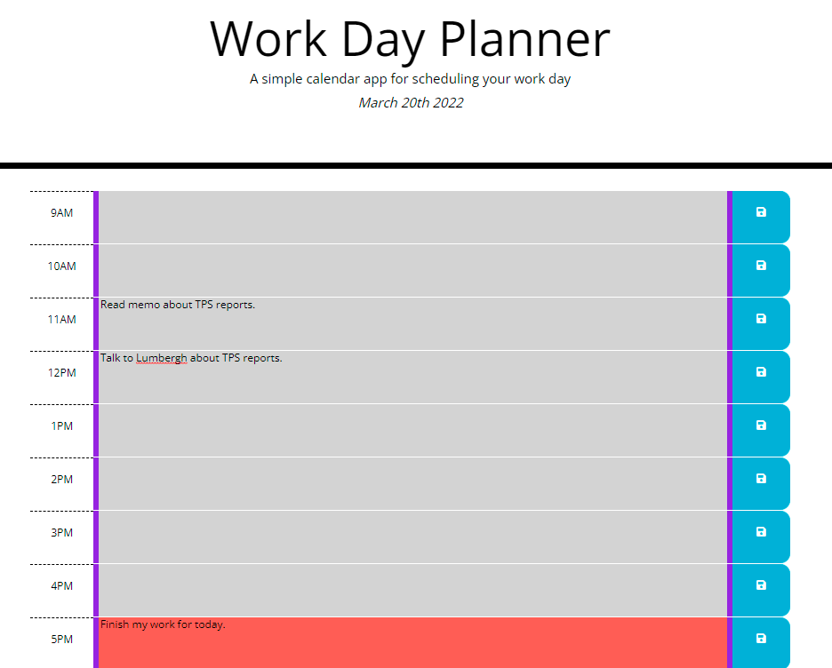

# day-planner

This is a simple work-day planner application. Work hours 9AM-5PM are displayed along with a space to enter tasks for each hour. Each row has a save button to save any tasks/notes entered for the corresponding hour. The planner data is retained until midnight each day when the planner tasks are all reset to blanks. Each hour is color coded to show if that hour has passed, is in the future, or if it is the current hour.

## Usage

The application can be accessed at: [https://chardmuffin.github.io/day-planner/](https://chardmuffin.github.io/day-planner/)

Click the color-shaded portion of any row to enter or edit notes. To save a note, click on the floppy-disk save icon on the corresponding row.

Closing the application and re-opening it within the same day will not cause any notes to become lost as long as the save button was clicked for each note.

When the hour changes, (e.g. from 9:59AM to 10:00AM), the color-shading will update to match the criteria:
* pink - past hours
* red - present hour
* green - future hours

When the day changes (e.g. from 11:59PM to 12:00AM), all saved notes will be cleared and tasks will return to blanks.

## License

[MIT](https://choosealicense.com/licenses/mit/)